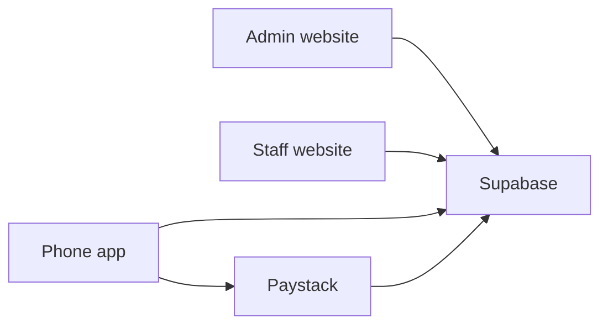
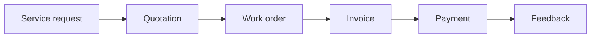
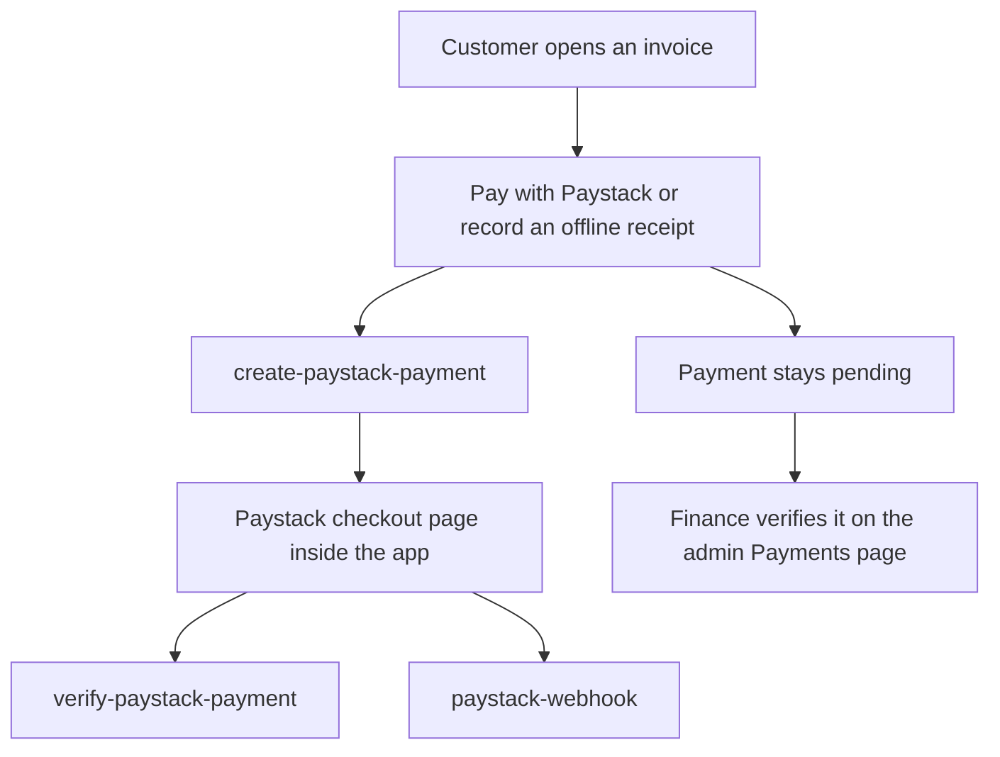

# Lakeview Marine Engineering Works Management System

This program helps a boat workshop in Kisumu, on Lake Victoria, keep track of its work.

A customer brings in a boat. The workshop writes down the problem, sends people to fix it, writes a price, sends a bill, and records the payment. The same program also tracks spare parts in the store and orders from suppliers.

You do not need to know how to program to try the websites. If you only want them running, jump to [Quick start](#17-quick-start).

The short name in the code is **LMEW-MS**. The phone app is called **Lakeview Marine**.

## Contents

1. [What this project does](#1-what-this-project-does)
2. [Words you will see](#2-words-you-will-see)
3. [What you need before you start](#3-what-you-need-before-you-start)
4. [Get a copy of the project](#4-get-a-copy-of-the-project)
5. [Easiest way: run the websites with Docker](#5-easiest-way-run-the-websites-with-docker)
6. [Configuration and environment variables](#6-configuration-and-environment-variables)
7. [Run the project while you are changing the code](#7-run-the-project-while-you-are-changing-the-code)
8. [What is in each folder](#8-what-is-in-each-folder)
9. [How the pieces work together](#9-how-the-pieces-work-together)
10. [How to use the apps](#10-how-to-use-the-apps)
11. [How to change the project](#11-how-to-change-the-project)
12. [How to run the tests](#12-how-to-run-the-tests)
13. [Build and deployment](#13-build-and-deployment)
14. [Troubleshooting](#14-troubleshooting)
15. [Questions people ask](#15-questions-people-ask)
16. [Important safety notes](#16-important-safety-notes)
17. [Quick start](#17-quick-start)

---

## 1. What this project does

### The problem

A marine workshop has many moving pieces at once:

- boats (the project calls them **vessels**)
- repair requests
- jobs for technicians
- price quotes
- bills (the project calls them **invoices**)
- payments
- spare parts on the shelf
- orders sent to suppliers

If those live in notebooks and separate spreadsheets, people lose track of who owns a job, what was quoted, and whether a bill was paid.

### What you get

This project is one shared system with three apps:

| App | Who it is for | What it is |
| --- | --- | --- |
| Admin website | Office staff, managers, finance, and suppliers | The full workshop desk in a web browser |
| Staff website | Store, procurement, reception, and suppliers | A smaller desk for those jobs |
| Phone app | Customers, technicians, and supervisors | An app named Lakeview Marine |

All three talk to the same database. A database is a program that stores information in tables, like a set of spreadsheets that the apps can read and update.



**Supabase** is the backend. A backend is the part you do not see in the browser. It holds the database, the sign-in system, file storage, and small server programs called Edge Functions.

**Paystack** is an outside payment service. The phone app can send a customer there to pay a bill by card or mobile money. The websites do not contain a Paystack checkout screen. On the web, finance staff record cash, bank, cheque, card, and M-Pesa receipts by hand.

### Main features

- Sign in with an email address and a password.
- Register a walk-in customer who does not have an account.
- Record vessels, service requests, appointments, work orders, quotations, invoices, and feedback.
- Track inventory, stock movements, suppliers, and purchase orders.
- Let a supplier see only their own purchase orders.
- Let a customer, on the phone, follow their request, read a quote, and pay an invoice.
- Let a technician update a job, add photos, and record parts.
- Let a supervisor see the team's jobs.
- Control which menu items a person sees, using roles and permissions.
- Keep an audit log of important changes.
- Send in-app notifications. Phone push messages need an extra Expo token.
- Build a simple PDF for a quotation, an invoice, or a report.

The normal path through the workshop looks like this:



A request can also be created at the front desk before a quote exists. The sample data already contains one request and one work order so you can click around immediately.

---

## 2. Words you will see

Read this once. The rest of the guide uses these words.

| Word | Plain meaning |
| --- | --- |
| Terminal | A window where you type commands. On Linux it is often called Terminal. On macOS it is the Terminal app. On Windows it is PowerShell or Command Prompt. |
| Command | One line you type in the terminal, then press Enter. |
| Folder / directory | A place that holds files. "Enter the project directory" means "go into the project folder in the terminal". |
| Repository | The project folder, including its history. This one is stored on GitHub. |
| Clone | Download a copy of the repository with Git. |
| Dependency / package | Code this project needs but does not write itself. A package manager installs those pieces for you. |
| Package manager | A tool that downloads packages. This project uses **pnpm**. |
| Runtime | The program that runs the code. The websites and phone app run on **Node.js**. |
| Server | A program that waits for requests and sends answers. The websites and the database each have a server. |
| Port | A number that lets one computer run many servers. `3000` is the admin website. `3001` is the staff website. |
| Localhost | Your own computer, as seen from itself. `http://localhost:3000` means "the admin website running on this computer, door number 3000". |
| URL | An address, like `http://localhost:3000`. |
| Frontend | The screens a person sees. Here, that is the two websites and the phone app. |
| Backend | The hidden part: database, sign-in, files, and Edge Functions. |
| API | A doorway programs use to ask the backend for data. Supabase provides that doorway. |
| Database | Where the rows are stored (customers, boats, invoices, and so on). This project uses Postgres, which Supabase starts for you. |
| Environment variable | A named setting stored outside the code, usually in a file called `.env`. Example: the address of the database. |
| Framework | A kit the programmers used to build the screens. The admin site uses React. The staff site uses Vue. The phone app uses Expo. |
| Role | A job title stored on the user, such as `administrator` or `customer`. |
| Permission | A specific allowed action, such as `invoices.view`. The admin menu is built from permissions. |
| Edge Function | A small program that runs next to the database. Payments, PDFs, and user admin use these. |
| Seed data | Practice records loaded into a fresh local database, including demo logins. |
| Migration | A numbered SQL file that builds or changes the database. SQL is the language used to talk to the database. |
| Monorepo | One repository that holds several apps and shared libraries. |

---

## 3. What you need before you start

There are two ways to run this project. Pick one.

### Path A — Websites only (the easy path)

You need **Docker**. Docker runs the database and both websites inside containers. A container is a packed copy of a program with everything it needs.

You do **not** need Node.js for this path. You do **not** need a `.env` file to sign in and click around.

| Requirement | Version this project expects | How to check |
| --- | --- | --- |
| Docker Engine | A current Docker Engine with Compose v2. The project does not pin a Docker version number. | `docker --version` |
| Docker Compose | Version 2, the `docker compose` command (with a space). | `docker compose version` |
| Free memory | About 4 GB free. The first start downloads several images. | Your system monitor |
| Disk space | Enough for the Supabase images. The project does not state a number. Plan on several gigabytes. | Your system monitor |
| Computer type | The Supabase image in this repo is built for Linux `amd64` and `arm64` only. | — |

The Docker notes in this repository are written for **Linux**. The compose file turns off the Linux AppArmor profile for the Supabase container so it can mount the project folder. On Linux, your user must be allowed to run Docker. That usually means membership in the `docker` group. After you are added to that group, log out and log back in.

macOS and Windows can use the same `docker compose` commands if Docker is installed (Docker Desktop is the usual install). This repository does not include a separate Mac or Windows installer, and it does not record that those systems were tested. The AppArmor line only applies on Linux.

**How to install Docker on Linux**

1. Open a terminal. On many Ubuntu computers, press Ctrl+Alt+T. Otherwise open the app menu and search for Terminal.
2. Install Docker Engine and the Compose plugin from Docker's own instructions: [https://docs.docker.com/engine/install/](https://docs.docker.com/engine/install/).
3. Allow your user to run Docker. On Linux that is usually:

```bash
sudo usermod -aG docker "$USER"
```

4. Log out of the computer and log back in. A new terminal is not always enough.
5. Check:

```bash
docker --version
docker compose version
docker run --rm hello-world
```

You should see version numbers, then a short "Hello from Docker" message. If `docker run` says permission denied, you are not in the `docker` group yet, or you have not logged in again.

**How to install Docker on macOS or Windows**

1. Install Docker Desktop from [https://docs.docker.com/desktop/](https://docs.docker.com/desktop/).
2. Open Docker Desktop and wait until it says it is running.
3. Open Terminal (macOS) or PowerShell (Windows).
4. Run the same three check commands as above.

### Path B — Change the code, or run the phone app

You need everything in Path A if you want the local database from Docker. You also need:

| Requirement | Version | How to check |
| --- | --- | --- |
| Node.js | `22.13.0` or newer. The `engines` field says `>=22.13.0`. GitHub Actions uses Node 22. | `node --version` |
| pnpm | `12.9.1`. The `packageManager` field says `pnpm@12.9.1`. `engines` says `pnpm >= 12`. | `pnpm --version` |
| Git | Any current Git. The project does not pin a version. | `git --version` |

There is no `.nvmrc` file and no `.node-version` file. The version rule lives in `package.json`.

**A real mismatch you should know about:** when Docker builds the websites, the file `docker/web.Dockerfile` installs **pnpm 11.22.0** inside the image. That is older than the pnpm 12.9.1 used on your computer and in GitHub Actions. If you are only using Docker, you do not install pnpm yourself. If you are writing code, install **pnpm 12.9.1**. Do not downgrade your computer to 11.22.0 to match the image.

**Install Git**

- Linux (Debian or Ubuntu example): `sudo apt update` then `sudo apt install git`
- Other Linux systems: use that system's package tool. The project does not ship those commands.
- macOS: install Git from [https://git-scm.com/downloads](https://git-scm.com/downloads), or install the Xcode Command Line Tools when the terminal asks.
- Windows: install Git from [https://git-scm.com/downloads](https://git-scm.com/downloads). The installer can also give you Git Bash.

Check with `git --version`. You should see a version number.

**Install Node.js**

1. Go to [https://nodejs.org/](https://nodejs.org/) and download Node.js **22.13.0 or newer**.
2. Run the installer. Accept the default options.
3. Close the terminal and open a new one.
4. Check:

```bash
node --version
```

You want `v22.13.0` or a higher number. If the number starts with `v18` or `v20`, that copy is too old for this project.

On Linux, the Node package in your system store is often too old. If `node --version` is below 22.13.0, install a newer Node from the Node.js website instead of using that older package.

**Install pnpm 12.9.1 with Corepack**

Corepack is a small tool that ships with Node.js. It installs the package manager named in the project.

```bash
corepack enable
corepack prepare pnpm@12.9.1 --activate
pnpm --version
```

You should see `12.9.1`.

If `corepack` is not found, your Node install is incomplete or older than this project allows. Install Node 22.13 or newer again, open a new terminal, and retry.

**Phone app extras**

The phone app is not inside Docker. It runs on your computer with Expo, then opens on a phone or an emulator.

| Goal | Extra software |
| --- | --- |
| Open the app on a real phone | The free **Expo Go** app from the App Store or Google Play. The phone and the computer must be on the same Wi-Fi network. |
| Open an Android emulator | Android Studio. This repository does not include Android Studio setup steps. |
| Open an iOS simulator | A Mac with Xcode. iOS builds cannot be made on Linux or Windows. |

The Expo config asks for the EAS command-line tool at version `12.0.0` or newer when you build an installable app in the cloud. You do not need EAS to try the app in Expo Go.

### Optional: Supabase CLI on the computer itself

You can start the database with Docker (recommended in this repo) or with the Supabase command-line tool on the host. The host is your computer, outside Docker.

The Docker image pins Supabase CLI **2.120.0** (`docker/supabase.Dockerfile`). The database major version in `supabase/config.toml` is **Postgres 17**.

This repository does not include a script that installs the CLI on the host. If you install it yourself, use **2.120.0** so it matches the Docker image. Supabase publishes install steps at [https://supabase.com/docs/guides/local-development/cli/getting-started](https://supabase.com/docs/guides/local-development/cli/getting-started).

Do not run a host `supabase start` and the Docker stack at the same time. They want the same ports.

---

## 4. Get a copy of the project

### 4.1 Download it with Git

1. Open a terminal.
2. Go to a folder where you keep projects. For example, your home folder:

```bash
cd ~
```

`cd` means "change directory". `~` means your home folder.

3. Download the repository. The address configured for this project is the SSH address. The same GitHub project can also be downloaded over HTTPS, which is easier if you have never set up SSH keys.

HTTPS:

```bash
git clone https://github.com/Hassan1910/lakeview-LMEW-MS.git
```

SSH (only if you already have a GitHub SSH key):

```bash
git clone git@github.com:Hassan1910/lakeview-LMEW-MS.git
```

4. Go into the new folder:

```bash
cd lakeview-LMEW-MS
```

Git names the folder after the GitHub project: `lakeview-LMEW-MS`. On one developer's computer the same folder happens to be named `lmew`. The name does not matter. You are in the right place when this command lists `package.json` and `docker-compose.yml`:

```bash
ls package.json docker-compose.yml
```

You should see both names. If the command says "No such file", you are in the wrong folder. Run `ls`, find the project folder, and `cd` into it.

GitHub Actions deploys from the branch named `main`. A branch is a line of saved changes. After a fresh clone, Git checks out the repository's default branch. Use that. This guide does not ask you to switch to any other branch.

### 4.2 Download a ZIP instead

1. Open [https://github.com/Hassan1910/lakeview-LMEW-MS](https://github.com/Hassan1910/lakeview-LMEW-MS) in a browser.
2. Use the **Code** button, then **Download ZIP**.
3. Unzip the file.
4. Open a terminal in the unzipped folder (the one that contains `package.json`).

On Linux, if the unzipped folder is in Downloads:

```bash
cd ~/Downloads
ls
```

Find the folder name (it often ends in `-main`), then:

```bash
cd lakeview-LMEW-MS-main
```

Use the name `ls` actually printed if it is different.

### 4.3 Stay in this folder

Every command in the rest of this guide, unless it says otherwise, is typed in the folder that contains `package.json`.

Check at any time with:

```bash
pwd
ls package.json
```

`pwd` prints the folder you are in.

---

## 5. Easiest way: run the websites with Docker

This starts Postgres, sign-in, file storage, realtime updates, Edge Functions, the admin website, and the staff website.

A `.env` file is **not** required for this. Studio, both websites, and the demo logins come up on localhost.

### 5.1 Start

1. Open a terminal in the project folder.
2. Run:

```bash
docker compose up -d --build
```

What those words mean:

- `docker compose` reads `docker-compose.yml`.
- `up` starts the services.
- `-d` means "detached": they keep running after the command returns.
- `--build` builds the website images and the Supabase image first.

3. Wait. The first start downloads Supabase's images. That often takes several minutes. The health check allows up to about 10 minutes (`start_period: 600s`) before Docker treats the Supabase container as unhealthy.

You can watch progress in a second terminal, from the same folder:

```bash
docker compose logs -f supabase
```

Press Ctrl+C to stop watching. That does not stop the containers.

### 5.2 How you know it worked

In the project folder, run:

```bash
docker compose ps
```

The `supabase` service should show **healthy**. `admin-web` and `staff-web` should be running or healthy too. The web apps wait until Supabase is healthy before they start, so they may stay waiting at first. That is normal.

Then check the API. An API health check asks "are you awake?"

Linux and macOS:

```bash
curl -fsS http://localhost:54321/auth/v1/health
```

Windows PowerShell: `curl` is sometimes a different command. Use:

```powershell
curl.exe -fsS http://localhost:54321/auth/v1/health
```

Success means the command finishes without `Connection refused`. If it fails, wait a little longer and try again. The first boot is slow.

Also open this address in a browser:

[http://localhost:3000/env.js](http://localhost:3000/env.js)

You should see text that mentions `http://localhost:54321` and an anon key. The anon key is a long public token the browser uses to talk to Supabase. It is created on your machine. It is not a password for the demo users.

### 5.3 Open the apps

| What | Address | What it is |
| --- | --- | --- |
| Admin website | [http://localhost:3000](http://localhost:3000) | Full workshop desk |
| Staff website | [http://localhost:3001](http://localhost:3001) | Store, procurement, reception, suppliers |
| API | [http://localhost:54321](http://localhost:54321) | The doorway the apps use |
| Studio | [http://localhost:54323](http://localhost:54323) | A web page for looking at database tables |
| Mailpit | [http://localhost:54324](http://localhost:54324) | A fake inbox. Local email is caught here. It is not sent to the internet. |

Postgres listens on port **54322**. Leave that port on your computer. Do not publish it on the internet. The shadow database port **54320** and the analytics port **54327** are also used by the local Supabase stack. The connection pooler port **54329** is turned off in `config.toml`.

A browser is a program such as Chrome, Firefox, or Edge. Type the address into the address bar and press Enter. `localhost` only works on the computer where Docker is running. Another computer cannot open `localhost` and see your copy.

### 5.4 Sign in

Every seeded user has the same password:

`LmewDemo123`

This password is written in `supabase/seed.sql` for the local demo. It is practice data. Do not use it on a real server.

Start here:

| Website | Email | Password | Who |
| --- | --- | --- | --- |
| [http://localhost:3000](http://localhost:3000) | `kevin@lakeviewmarine.co.ke` | `LmewDemo123` | Kevin Kiprotich Langat, administrator |
| [http://localhost:3001](http://localhost:3001) | `george@lakeviewmarine.co.ke` | `LmewDemo123` | George Onyango, store manager |

The administrator is also allowed into the staff website.

### 5.5 Every demo account

| Name | Email | Role | Where to sign in |
| --- | --- | --- | --- |
| Kevin Kiprotich Langat | `kevin@lakeviewmarine.co.ke` | administrator | Admin and staff websites |
| David Muriithi | `david@lakeviewmarine.co.ke` | service_manager | Admin website |
| Otieno James | `otieno@lakeviewmarine.co.ke` | supervisor | Phone app, and the admin website |
| Brian Omondi | `brian@lakeviewmarine.co.ke` | technician | Phone app |
| Samuel Kipkorir | `samuel@lakeviewmarine.co.ke` | technician | Phone app |
| Mercy Chebet | `mercy@lakeviewmarine.co.ke` | finance_manager | Admin website |
| George Onyango | `george@lakeviewmarine.co.ke` | store_manager | Admin and staff websites |
| Achieng Grace | `grace@lakeviewmarine.co.ke` | receptionist | Admin and staff websites |
| Nelly Akinyi | `procurement@lakeviewmarine.co.ke` | procurement_officer | Admin and staff websites |
| David Omwega | `supplier@kenyamarine.co.ke` | supplier | Admin and staff websites |
| Captain Peter Wanyama | `peter.wanyama@victoriaferries.co.ke` | customer | Phone app |
| Hassan Ali Mohamed | `hassan.ali@lakefishers.com` | customer | Phone app |

Password for every row: `LmewDemo123`.

The sample company is **Lakeview Marine Engineering Works**, Marine Drive, Kisumu Pier Yards. The sample boats are **MV Victoria Star** (Victoria Ferries Ltd) and **Simba wa Ziwa II** (Nyanza Fisheries Cooperative). There is already a service request titled **Port engine overheating**, in status `inspection_in_progress`, and a work order assigned to Brian Omondi, supervised by Otieno James.

### 5.6 Stop, start again, and reset

Stop the websites and Supabase, and keep the saved data:

```bash
docker compose down
```

Start again later, without a full rebuild:

```bash
docker compose up -d
```

Rebuild after you change the website code and want Docker to serve the new build:

```bash
docker compose up -d --build
```

Wipe the local database and load the migrations and seed again. This deletes local demo edits:

```bash
docker compose exec supabase lmew-supabase db reset
```

Do not run `supabase stop --no-backup` unless you mean to delete that data.

New SQL files in `supabase/migrations` are applied the next time the Supabase container starts. To use a newer Supabase CLI inside Docker, change `SUPABASE_CLI_VERSION` in `docker/supabase.Dockerfile` and the image tag in `docker-compose.yml`, then rebuild. This guide does not ask you to do that.

### 5.7 What Docker is allowed to do

The Supabase service mounts the Docker socket. That socket lets the container start and stop other containers. Use this on a private computer. Put a firewall and HTTPS in front of the computer before anyone else can reach it. HTTPS is the locked form of a web address. Do not publish Postgres (`54322`) to the internet.

The service-role key is a master key for the database. Docker keeps it on the Supabase container. It is not written into the website image and it is not sent to the browser.

More Docker detail is in `DOCKER.md`.

---

## 6. Configuration and environment variables

An environment variable is a setting with a name and a value. This project keeps an example list in `.env.example`. A real `.env` file is ignored by Git (see `.gitignore`). Never commit a `.env` file. Commit means "save into the shared project history".

### 6.1 When you do not need a `.env` file

`docker compose up -d --build` works with no `.env` file.

After Supabase is healthy, Docker writes two generated files:

| File | What it contains |
| --- | --- |
| `docker/runtime/env.js` | The public Supabase address and anon key, for the websites. The browser loads this as `/env.js`. |
| `docker/runtime/public.env` | The same public values, in `.env` form, including the `EXPO_PUBLIC_` lines for the phone app. |

Both files are created on your machine. `docker/runtime/` is listed in `.gitignore`. If you delete the folder, the next healthy start creates it again.

The websites read `window.__LMEW_PUBLIC_ENV__` from that file first. That is why the Docker websites can sign in before you create a `.env`.

### 6.2 When you do need a `.env` file

Create one only when you need one of these:

- Paystack payments
- Expo push notifications
- A public API address other than `http://localhost:54321` (a real phone cannot use `localhost`)
- `pnpm dev` (the developer servers). Those servers read `VITE_` and `EXPO_PUBLIC_` values from a `.env` file. They do not use Docker's `env.js`.

Copy the example file in the **project root** (the folder with `package.json`):

Linux and macOS:

```bash
cp .env.example .env
```

Windows Command Prompt:

```cmd
copy .env.example .env
```

Windows PowerShell:

```powershell
Copy-Item .env.example .env
```

`.env.example` says "copy this file to `.env` in the app that needs it". The running apps are set up differently: the admin and staff Vite configs set `envDir` to the repository root, and the phone app's `app.config.ts` loads the repository root as well. Put the one `.env` next to `package.json`. A `.env` inside `apps/admin-web` is not the file those dev servers are configured to read.

Open `.env` in a text editor. Replace only the values you need. Leave the rest as placeholders until you have real ones.

Docker treats these as empty and skips them:

- values that start with `your-` or `your_`
- values that contain `xxxxxxxx`

So the sample `pk_test_xxxx...` lines are ignored until you replace them with real Paystack keys.

### 6.3 Every variable in `.env.example`

Placeholders below are not real keys. Do not invent a key by copying the `xxxx` text into a live Paystack account. Get the real value from the service that owns it.

| Variable | Who should see it | What it means | Safe example |
| --- | --- | --- | --- |
| `VITE_SUPABASE_URL` | Admin and staff websites | Address of the Supabase API. Vite only exposes names that start with `VITE_` to the browser. | `http://localhost:54321` for this computer, or `https://your-project.supabase.co` for a hosted project |
| `VITE_SUPABASE_ANON_KEY` | Admin and staff websites | The anon key. It is public by design. It is not the service-role key. Row rules in the database still limit what a signed-in person can read. | Copy the local value from `docker/runtime/public.env` after Docker is healthy. For a hosted project, copy the anon key from that project's API settings. |
| `EXPO_PUBLIC_SUPABASE_URL` | Phone app | Same API address, for Expo. Expo only exposes names that start with `EXPO_PUBLIC_`. | Same value as `VITE_SUPABASE_URL` |
| `EXPO_PUBLIC_SUPABASE_ANON_KEY` | Phone app | Same anon key, for Expo. | Same value as `VITE_SUPABASE_ANON_KEY` |
| `EXPO_PUBLIC_API_BASE` | Listed for the phone app | Example file and Docker set this to the Supabase URL plus `/functions/v1`. The phone source does not mention this name. Calls go through the Supabase client, which uses the Supabase URL. | `http://localhost:54321/functions/v1` |
| `SUPABASE_URL` | Edge Functions on a server | Server-side copy of the API address. The local CLI injects this itself. You do not need to set it for the Docker demo. | `https://your-project.supabase.co` |
| `SUPABASE_SERVICE_ROLE_KEY` | Edge Functions only | Master key. It bypasses row rules. Never put it in a website, a phone app, or a public file. The local CLI injects it. Docker does not bake it into the website image. | `YOUR_SERVICE_ROLE_KEY` from the hosted project's API settings, server side only |
| `VITE_PAYSTACK_PUBLIC_KEY` | Described as the website's public Paystack key | `.env.example` says web clients use it for Paystack Inline checkout. No file in `apps/` or `packages/` reads this name. Current checkout is started by the Edge Function with the secret key. | `pk_test_YOUR_PUBLIC_KEY` |
| `EXPO_PUBLIC_PAYSTACK_PUBLIC_KEY` | Described as the phone app's public Paystack key | Same situation. No application source file reads this name. | `pk_test_YOUR_PUBLIC_KEY` |
| `PAYSTACK_SECRET_KEY` | Edge Functions only | Secret Paystack key. `create-paystack-payment` and `verify-paystack-payment` read it. Never put it in a client app. | `sk_test_YOUR_SECRET_KEY` from the Paystack dashboard, test mode |
| `PAYSTACK_WEBHOOK_SECRET` | Edge Function `paystack-webhook` only | Paystack signs webhook calls with this secret. The function checks the `x-paystack-signature` header. | `YOUR_PAYSTACK_WEBHOOK_SECRET` |
| `EXPO_ACCESS_TOKEN` | Edge Function `send-notification` | Token used to send Expo push notifications. Sign-in works without it. Push delivery does not. | `YOUR_EXPO_ACCESS_TOKEN` |
| `LMEW_HOTLINE` | Copied into the function env file if you set it | Example value `+254700000000`. No application source file reads this name. The seeded company row has its own phone in the database. | `+254700000000` |
| `LMEW_LOCATION` | Copied into the function env file if you set it | Example text `Kisumu Port / Lake Victoria, Kenya`. No application source file reads this name. | `Kisumu Port / Lake Victoria, Kenya` |
| `PAYSTACK_CALLBACK_URL` | Edge Function `create-paystack-payment` | Web fallback when the phone app does not send a callback address. The app itself uses `lmew://paystack/callback` and `lmew://paystack/cancel`. | `https://your-domain.com/payment/callback` |
| `PUBLIC_SUPABASE_URL` | Docker only | The address browsers and phones use to reach the API. Default, if unset, is `http://localhost:54321`. | `http://localhost:54321` or `http://192.168.1.20:54321` |

The older file `docs/env.json` lists `MPESA_CONSUMER_KEY` and other `MPESA_*` names. Those names are not in `.env.example`, and the Edge Functions do not use them. Online checkout in the code is Paystack. A customer can still record an offline M-Pesa receipt. That receipt stays pending until finance confirms it. It is not an M-Pesa STK push to the phone. The pay screen says the Paystack checkout stays inside the app.

### 6.4 Where Docker puts secrets

If `.env` exists, `docker/supabase-up.sh` copies these keys into `supabase/functions/.env` when they are not placeholders:

- `PAYSTACK_SECRET_KEY`
- `PAYSTACK_WEBHOOK_SECRET`
- `PAYSTACK_CALLBACK_URL`
- `EXPO_ACCESS_TOKEN`
- `LMEW_HOTLINE`
- `LMEW_LOCATION`

`supabase/functions/.env` is gitignored. The website images do not contain those secrets.

After you change Paystack or Expo values, recreate the Supabase container so it writes the file again:

```bash
docker compose up -d --force-recreate supabase
```

### 6.5 A real phone on your Wi-Fi

`localhost` on a phone means the phone itself, not your computer.

1. Find your computer's LAN address. LAN means the home or office network. On Linux you can run `hostname -I` and use the first address, often starting with `192.168.`.
2. In the project `.env`, set:

```bash
PUBLIC_SUPABASE_URL=http://192.168.1.20:54321
```

Use your address, not `192.168.1.20`, unless that really is your computer.

3. Recreate the stack:

```bash
docker compose up -d --force-recreate supabase
```

4. Wait until it is healthy.
5. Copy the `EXPO_PUBLIC_` lines from `docker/runtime/public.env` into the root `.env`.
6. Start the phone app (section 7).

The repository does not document how to open port 54321 on every brand of firewall. If the phone cannot connect, the computer firewall is a likely cause.

### 6.6 Hosted Supabase, Paystack, and Expo

This repository does not contain a cloud project id, a live URL, or real keys.

- **Supabase cloud:** create a project at [https://supabase.com](https://supabase.com). Copy the project URL and the anon key into the `VITE_` and `EXPO_PUBLIC_` variables. Put the service-role key only in server secret storage.
- **Paystack:** create a test account at [https://paystack.com](https://paystack.com). Copy the test secret key into `PAYSTACK_SECRET_KEY`. Test keys start with `sk_test_`. Live keys start with `sk_live_`. Use test keys until you mean to take real money.
- **Expo push:** create an access token in your Expo account and set `EXPO_ACCESS_TOKEN` if you need push delivery.
- **Webhooks:** Paystack must be able to reach your server on the public internet. A laptop `localhost` address is not reachable by Paystack. The phone app can still call `verify-paystack-payment` itself after checkout. This repository does not include a tunnel program for local webhooks.

---

## 7. Run the project while you are changing the code

Use this when you are editing source files and want the screens to refresh. The Docker websites in section 5 are built copies. They do not refresh when you edit a file.

You need Path B from section 3 (Node.js and pnpm 12.9.1), and a database that is already running.

### 7.1 Install the dependencies

In the project folder:

```bash
pnpm install
```

This reads `pnpm-lock.yaml` and downloads the packages into `node_modules`. The first run can take a few minutes. When it finishes, the terminal returns to a prompt and does not print a red error.

If you want the same locked set that GitHub Actions uses:

```bash
pnpm install --frozen-lockfile
```

### 7.2 Start the database

**Option 1 — Docker (matches this repo).** From section 5:

```bash
docker compose up -d --build
```

The Docker websites also occupy ports 3000 and 3001. The developer servers want those same ports. Stop the Docker websites before you start the developer servers:

```bash
docker compose stop admin-web staff-web
```

Leave the `supabase` service running.

Then point the developer apps at that database. Copy `VITE_SUPABASE_URL`, `VITE_SUPABASE_ANON_KEY`, `EXPO_PUBLIC_SUPABASE_URL`, and `EXPO_PUBLIC_SUPABASE_ANON_KEY` from `docker/runtime/public.env` into the root `.env`.

**Option 2 — Supabase CLI on the host.** With CLI 2.120.0 installed, from the project folder:

```bash
supabase start
```

The first run downloads images and can take several minutes. When it finishes, the CLI prints local URLs and keys. Put the API URL and anon key into the root `.env`:

```bash
VITE_SUPABASE_URL=http://localhost:54321
VITE_SUPABASE_ANON_KEY=YOUR_LOCAL_ANON_KEY
EXPO_PUBLIC_SUPABASE_URL=http://localhost:54321
EXPO_PUBLIC_SUPABASE_ANON_KEY=YOUR_LOCAL_ANON_KEY
EXPO_PUBLIC_API_BASE=http://localhost:54321/functions/v1
```

Replace `YOUR_LOCAL_ANON_KEY` with the anon key the CLI printed. Do not paste a service-role key into these four lines.

Seed data loads because `supabase/config.toml` has `[db.seed] enabled = true` and `sql_paths = ["./seed.sql"]`. A reset loads it again:

```bash
supabase db reset
```

That deletes local data and rebuilds the database. Do not run it against a database you need to keep.

### 7.3 Start the admin website and the phone app

```bash
pnpm dev
```

That root script is:

```text
turbo dev --filter=@lmew/admin-web --filter=@lmew/mobile
```

It starts **two** programs and leaves them running:

| Program | Address | What success looks like |
| --- | --- | --- |
| Admin website | [http://localhost:3000](http://localhost:3000) | Vite prints a local URL. The browser shows a **Sign in** page. |
| Phone app | Expo's dev server | Expo prints a QR code and a menu. The project does not pin the port. Expo usually uses **8081**. If that port is busy, Expo tells you. |

This command does **not** start the staff website.

Leave this terminal open. Closing it or pressing Ctrl+C stops the dev servers.

### 7.4 Start the staff website

Open a **second** terminal. Go to the same project folder. Run:

```bash
pnpm --filter @lmew/staff-web dev
```

Success: Vite prints a local URL on port **3001**. Open [http://localhost:3001](http://localhost:3001). The heading says **Staff sign in**.

### 7.5 Commands you can run one at a time

| What you want | Command | Port |
| --- | --- | --- |
| Admin website only | `pnpm --filter @lmew/admin-web dev` | 3000 |
| Staff website only | `pnpm --filter @lmew/staff-web dev` | 3001 |
| Phone app only | `pnpm --filter @lmew/mobile dev` | Expo's usual 8081 |
| Same phone start | `pnpm --filter @lmew/mobile start` | same |
| Android emulator | `pnpm --filter @lmew/mobile android` | needs Android tooling |
| iOS simulator | `pnpm --filter @lmew/mobile ios` | needs a Mac and Xcode |
| Phone app in a browser | `pnpm --filter @lmew/mobile web` | Expo prints the URL |

The app name is **Lakeview Marine**. The URL scheme is `lmew`, so payment return links look like `lmew://paystack/callback`. A URL scheme is a private prefix that opens this app.

### 7.6 What you should see

**Admin site** at [http://localhost:3000/login](http://localhost:3000/login):

- Heading: **Sign in**
- Sentence: "One sign-in for every staff role and supplier. You will see the modules your role allows."
- Boxes for Email and Password
- A **Remember me** checkbox
- A **Sign in** button

**Staff site** at [http://localhost:3001/login](http://localhost:3001/login):

- The name **Lakeview Marine**
- Heading: **Staff sign in**
- Sentence: "Store, procurement, reception, and supplier accounts."
- Email, Password, and **Sign in**

**Phone app**, after you scan the QR code with Expo Go:

- The Lakeview Marine brand
- The sentence "Sign in to track repairs, jobs, and payments."
- Email and Password
- Buttons: **Sign in**, **Create an account**, **Forgot password**, **Sign in with a phone code**

The phone-code screen exists. Local `supabase/config.toml` has SMS sign-up turned off, so this project does not send those text messages in the local setup. Email and password is the path that works with the seed users.

If the website says `Set VITE_SUPABASE_URL and VITE_SUPABASE_ANON_KEY`, the root `.env` is missing those values, or the dev server was started before you saved `.env`. Stop it with Ctrl+C and start it again.

---

## 8. What is in each folder

```text
lakeview-LMEW-MS/
├── apps/
│   ├── admin-web/          React admin website
│   ├── staff-web/          Vue staff website
│   └── mobile/             Expo phone app
├── packages/
│   ├── shared-types/       Shared types, checks, and workflow rules
│   ├── supabase-client/    Shared Supabase connection
│   └── ui-tokens/          Shared colors and type styles
├── supabase/
│   ├── config.toml         Local ports, auth, and function settings
│   ├── migrations/         17 SQL files that build the database
│   ├── seed.sql            Demo company, parts, boats, and logins
│   ├── functions/          8 Edge Functions
│   └── tests/              Database tests
├── docker/                 Dockerfiles and startup scripts
├── docs/                   Specification files (some are older than the code)
├── brand/                  Logo artwork
├── .github/workflows/      GitHub Actions checks and deploys
├── scripts/                Empty. Operational scripts live in docker/
├── package.json            Root scripts and pnpm / Node versions
├── pnpm-workspace.yaml     Tells pnpm that apps/* and packages/* are packages
├── turbo.json              Task runner settings
├── docker-compose.yml      The three Docker services
├── vercel.json             How Vercel serves the two websites
├── .env.example            Every documented setting, with placeholders
└── DOCKER.md               Short Docker notes
```

A task runner (Turbo) runs the same command in each package in a safe order. For example, shared packages are built before the apps that use them.

### 8.1 `apps/admin-web`

React 19 and Vite 8. Entry file: `src/main.tsx`, then `src/App.tsx`, which lists the routes.

| Route | Screen |
| --- | --- |
| `/login` | Sign in |
| `/forgot-password` | Ask for a reset email |
| `/reset-password` | Set a new password from that email |
| `/dashboard` | Summary charts |
| `/notifications` | In-app notices |
| `/search` | Search |
| `/profile` | Your profile |
| `/reception` | Register a walk-in customer |
| `/requests/new` | Create a service request for a customer |
| `/appointments` | Visits and inspections |
| `/team` | Technicians |
| `/service-requests` and `/service-requests/:id` | Request list and one request |
| `/work-orders` and `/work-orders/:id` | Jobs |
| `/quotations` | Quotes |
| `/customers` and `/customers/:id` | Customers |
| `/vessels` and `/vessels/:id` | Boats |
| `/feedback` | Customer feedback |
| `/invoices` and `/invoices/:id` | Bills |
| `/payments` | Record, verify, or refund payments |
| `/reports` | Reports |
| `/inventory`, `/inventory/:id`, `/inventory/report` | Parts |
| `/stock-movements` | Stock in and out |
| `/suppliers` | Suppliers |
| `/purchase-orders` and `/purchase-orders/:id` | Purchase orders |
| `/my-orders` and `/my-orders/:id` | A supplier's own orders |
| `/users` | User admin |
| `/roles` | Roles and permissions |
| `/company` | Company profile |
| `/audit` | Audit log |
| `/settings` | Settings notes |

`:id` means "a specific record's id in the address".

The menu is defined in `src/auth/access.ts`. A person only sees rows their permissions allow. After sign-in, the app opens the first visible module.

There is no sign-up page on this website. Staff accounts are created by an administrator.

Browser tests live in `e2e/`.

### 8.2 `apps/staff-web`

Vue 3.5 and Vite 8. Entry file: `src/main.ts`, then `src/App.vue`. Routes are in `src/router.ts`.

| Route | Who | Screen |
| --- | --- | --- |
| `/login` | Everyone, before sign-in | Staff sign in |
| `/` | store manager, procurement, receptionist, supplier, administrator | Home numbers for that role |
| `/inventory` and `/inventory/:id` | store, procurement, administrator | Parts |
| `/stock-movements` | store, procurement, administrator | Stock movements |
| `/purchase-orders` and `/purchase-orders/:id` | store, procurement, administrator; suppliers can open a detail page | Purchase orders |
| `/suppliers` | store, procurement, administrator | Suppliers |
| `/my-orders` | supplier | That supplier's orders |
| `/appointments` | receptionist, administrator | Appointments |
| `/service-requests/new` | receptionist, administrator | New request |
| `/walk-in` | receptionist, administrator | Walk-in registration |
| `/reception` | — | Redirects to `/walk-in` |
| `/reports/inventory` | store manager, administrator | Stock report |
| `/profile` | those staff roles | Profile |

On Vercel, this app is served under `/staff`. Locally and in Docker, the base path is `/`, so you open port 3001 directly.

There is no forgot-password page in this app.

### 8.3 `apps/mobile`

Expo SDK 57, React Native 0.86, file-based routes under `app/`. The app id is `ke.co.lakeviewmarine.app` on both iOS and Android. EAS project settings are in `app.json` and `eas.json`.

| Area | Folder | Who |
| --- | --- | --- |
| Sign in, register, forgot password, phone code | `app/(auth)/` | Anyone not signed in |
| Customer home, requests, vessels, quotes, invoices, pay, feedback | `app/(customer)/` | `customer` |
| Today's jobs, job photos, parts | `app/(technician)/` | `technician` |
| Team jobs, technicians, reports | `app/(supervisor)/` | `supervisor` |
| Paystack return and cancel | `app/paystack/` | The payment flow |
| "Use a browser" message | `app/portal.tsx` | Any other role |

`app/index.tsx` is the opening screen. `app/_layout.tsx` sends each role to the right area.

### 8.4 `packages`

| Package | Job |
| --- | --- |
| `@lmew/shared-types` | Database types, form checks (Zod), workflow rules, Paystack helpers. This is the only package with a `test` script. |
| `@lmew/supabase-client` | Creates the shared Supabase client. |
| `@lmew/ui-tokens` | Shared colors, type styles, and `tokens.css`. |

Apps depend on these with `workspace:*`, which means "use the copy inside this repository".

### 8.5 `supabase`

`config.toml` sets `project_id = "lmew"` and these local ports:

| Service | Port |
| --- | --- |
| API | 54321 |
| Database | 54322 |
| Shadow database (used by diffs) | 54320 |
| Pooler | 54329, and it is **disabled** |
| Studio | 54323 |
| Mailpit web inbox | 54324 |
| Analytics | 54327 |

Auth settings that matter locally:

- Site URL: `http://127.0.0.1:3000`
- Extra redirect URLs include `localhost` and `127.0.0.1` on ports 3000 and 3001
- Email confirmation is off, so a new local account can sign in without clicking a mail link
- Minimum password length is 6
- Public sign-up is enabled
- Anonymous sign-in is off
- SMS sign-up is off
- Multi-factor sign-in is off

`127.0.0.1` is another way to write "this computer", like `localhost`.

Edge Functions and whether they require a signed-in user (JWT means the sign-in token):

| Function | JWT checked | What it does |
| --- | --- | --- |
| `create-paystack-payment` | Yes | Starts a Paystack payment for an invoice |
| `verify-paystack-payment` | Yes | Asks Paystack whether that payment succeeded |
| `paystack-webhook` | No. It checks Paystack's signature instead | Receives `charge.success` and `refund.processed` |
| `generate-pdf` | Yes | Builds a simple PDF and returns a link |
| `send-notification` | Yes, and it requires the service-role token | Writes a notification and can send an Expo push |
| `manage-users` | Yes, and the caller needs `users.manage` | Create, invite, suspend, restore, remove, and reset users |
| `low-stock-cron` | Yes, service role | Scheduled daily at 06:00. Warns when stock is low. |
| `overdue-invoice-cron` | Yes, service role | Scheduled daily at 07:00. Marks overdue invoices and notifies people. |

The schedule lines are in `supabase/config.toml`. A schedule is a clock rule for the server. Those clocks run in the Supabase project that has them turned on. This guide does not claim the Docker demo sends those messages on your laptop every morning.

Migrations, in order:

| File | What it adds |
| --- | --- |
| `20250101000000_init_lmew_schema.sql` | Core tables |
| `20250101000001_functions_and_triggers.sql` | Number sequences, new-user handling, totals |
| `20250101000002_rls_policies.sql` | Row-level security. Each row can have a rule about who may see it. |
| `20250101000003_paystack_and_policy_fixes.sql` | Paystack as a payment method, push-token column |
| `20250101000004_storage_rls_and_appointments.sql` | Appointments, file buckets, realtime |
| `20250101000005_security_and_flows.sql` | Payment proof uploads and related rules |
| `20250101000006_rbac_roles_permissions.sql` | Roles, permissions, and the ten system roles |
| `20250101000007_rbac_audit_trail.sql` | Audit triggers |
| `20250101000008_rbac_user_admin.sql` | Helpers for the user-admin function |
| `20250101000009_lock_down_definer_functions.sql` | Limits who can call sensitive database functions |
| `20250101000010_purchase_order_totals.sql` | Purchase-order totals |
| `20250101000011_ensure_customer_profile.sql` | Lets a customer finish their own customer record |
| `20250101000012_audit_integrity.sql` | Guards on deletes, payments, and receiving stock |
| `20250101000013_fix_rls_recursion.sql` | Fixes a loop in the row rules |
| `20250101000014_sync_request_status_from_work_orders.sql` | Moves a request forward when its jobs are done |
| `20250101000015_audit_fixes.sql` | Stock, balances, supplier limits, one invoice per quote |
| `20250101000016_remaining_writes.sql` | Cancelled payments and guarded save/assign/receive functions |

`docs/live-security.md` is the security write-up. It says the running database is the migrations, and that the JSON specs are the older design. That file's sentence stops at migration `00015`. The folder also contains `00016`. Trust the SQL files when they disagree with the JSON specs.

File buckets include avatars, vessel photos, service attachments, work-order media, quotation PDFs, invoice PDFs, and reports. The largest upload configured in `config.toml` is 50MiB.

### 8.6 `docker`

| File | Job |
| --- | --- |
| `supabase.Dockerfile` | Supabase CLI 2.120.0 |
| `web.Dockerfile` | Builds one website with Node 22 and serves it with nginx 1.27 |
| `supabase-up.sh` | Starts Supabase, writes function secrets, writes `docker/runtime` |
| `lmew-supabase.sh` | Lets you run CLI commands inside the container |
| `resolve-project.sh` | Maps the container folder back to your computer |
| `nginx.conf` | Serves the website and `/env.js` |

`docker-compose.yml` publishes admin on **3000** and staff on **3001**.

### 8.7 `docs`

JSON files such as `prd.json`, `architecture.json`, and `tech-stack.json` are design notes. `tech-stack.json` describes older targets than the packages you install (the code uses React 19, Expo 57, and a Vue staff site). When a version or an environment variable disagrees, follow `package.json`, `.env.example`, and the source code.

### 8.8 GitHub workflows

| File | When it runs | What it does |
| --- | --- | --- |
| `.github/workflows/admin.yml` | Pull requests, and pushes to `main` | Install, build packages, lint and test shared types, lint and typecheck the admin app, run Playwright, and deploy to Vercel on `main` if `VERCEL_TOKEN` is set |
| `.github/workflows/mobile.yml` | Pull requests, and tags that start with `v` | Lint and typecheck the phone app, test shared types, and start an EAS build if `EXPO_TOKEN` is set |
| `.github/workflows/supabase.yml` | Pushes to `main` that touch `supabase/**` | Test shared types, then `supabase db push` and deploy seven functions if the Supabase secrets are set |

There is no `staff.yml` file. A pull request is a proposed change on GitHub. A tag is a named snapshot, used here for a production phone build.

---

## 9. How the pieces work together

### Sign-in

1. The person types an email and a password.
2. The app sends them to Supabase Auth.
3. Supabase returns a session. A session is proof that this browser or phone is signed in.
4. A database trigger named `handle_new_user` creates a profile. A brand-new sign-up is always the role `customer`. A person cannot change their own role or their own active flag.
5. The app loads the profile and the permissions.

Where each role lands:

| Role | Admin website | Staff website | Phone app |
| --- | --- | --- | --- |
| administrator | Every module. This role is treated as having every permission. | Allowed | Sent to the "use a browser" page |
| service_manager | Modules that role's permissions allow | Refused | "Use a browser" page |
| supervisor | Modules that role's permissions allow | Refused | Supervisor tabs |
| finance_manager | Finance and related modules | Refused | "Use a browser" page |
| store_manager | Inventory and purchasing | Allowed | "Use a browser" page |
| procurement_officer | Inventory and purchasing | Allowed | "Use a browser" page |
| receptionist | Front desk | Allowed | "Use a browser" page |
| supplier | Only **My purchase orders** | Allowed | "Use a browser" page |
| technician | Refused. The role grant does not include `portal.access`. | Refused | Technician tabs |
| customer | Refused, with "Your role does not include access to the web dashboard." | Refused | Customer tabs |

The staff website's refusal text is: "This portal is for store, procurement, reception, and supplier roles".

A suspended account (`is_active` turned off) sees: "This account is suspended. Ask an administrator to restore it."

Password reset from the admin site or the phone app sends mail. Locally, open Mailpit at [http://localhost:54324](http://localhost:54324) and use the link there. The link is not delivered to a real inbox.

### A repair, from request to feedback

1. A customer creates a request in the phone app, or a receptionist creates one on the web (walk-in or **New service request**).
2. A service manager assigns people. The sample request is already assigned, with a work order for Brian.
3. The workshop can write a quotation. The customer can see quotations on the phone.
4. Technicians update the job, add photos, and record parts. Supervisors can look across the team.
5. Finance issues an invoice. The settings page states: "Online checkout uses Paystack. Issued invoices are due 14 days after they are created. Cash, bank, and M-Pesa receipts are recorded under Payments."
6. The customer pays in the phone app, or finance records a payment on the admin **Payments** page.
7. The customer can leave feedback on the request.

### Payments



Online path:

1. The phone app calls `create-paystack-payment` with the invoice id.
2. The function calls Paystack and stores a pending payment row.
3. A page inside the app opens Paystack. Currency in this flow is Kenyan shillings (KES).
4. Paystack sends the person back to `lmew://paystack/callback`, or to the cancel link.
5. The app calls `verify-paystack-payment`.
6. If Paystack can reach your public server, `paystack-webhook` can confirm the same payment. The webhook does not use the user's sign-in token. It checks the signature header instead.

Offline path: the customer, or finance, records M-Pesa, bank, cash, card, or cheque, with an optional receipt photo. The row stays pending until someone with permission verifies it.

The admin **Payments** page can record a payment, verify a pending one, or refund a confirmed one. There is no Paystack checkout button in the admin or staff websites.

### Shared code

- `packages/shared-types/src/workflow.ts` holds status rules.
- `packages/shared-types/src/validators.ts` holds the form checks the screens use.
- `packages/shared-types/src/paystack-flow.ts` holds the `lmew://` callback names.
- `packages/supabase-client` is how the apps get a Supabase connection.
- `packages/ui-tokens` is the shared look.

The database, not the browser, is the authority for who may read a row. The browser can be changed by anyone. The row rules still apply.

---

## 10. How to use the apps

These steps assume the Docker stack from section 5 is healthy, or the developer servers from section 7 are running, and the seed data is loaded.

### 10.1 Administrator on the admin website

1. Open [http://localhost:3000](http://localhost:3000).
2. You should see the **Sign in** heading.
3. Email: `kevin@lakeviewmarine.co.ke`
4. Password: `LmewDemo123`
5. Click **Sign in**.
6. You should land on a workshop page with a side menu. An administrator can see **Dashboard**, **Invoices**, **Inventory**, **Users**, **Roles & permissions**, and **Audit log**, among other items.
7. Click **Service requests**. You should see **Port engine overheating**.
8. Open that request. You should see the vessel **MV Victoria Star** and the inspection status.
9. Click **Vessels**. You should see **MV Victoria Star** and **Simba wa Ziwa II**.
10. Click **Inventory**. You should see parts such as the Yamaha water-pump impeller and the Rule bilge pump. One propeller in the seed is at or below its reorder level (2 on hand, reorder at 4).
11. Click **Users** if you want to see the demo people. Creating a real staff user calls the `manage-users` Edge Function. On a laptop demo you can look without changing anything.
12. Click **Settings**. You should see the Paystack and 14-day invoice note. The page does not show the demo password.

To sign out, use the sign-out control in the app shell (the frame around the page). Then the Sign in page returns.

### 10.2 Store manager on the staff website

1. Open [http://localhost:3001](http://localhost:3001).
2. You should see **Staff sign in**.
3. Email: `george@lakeviewmarine.co.ke`
4. Password: `LmewDemo123`
5. Click **Sign in**.
6. You should see the staff home for a store manager, with inventory and purchase-order links.
7. Open **Inventory**. You should see the same parts as in the admin site, because both apps read the same database.
8. Open **Suppliers**. You should see **Kenya Marine Supplies Ltd** (contact David Omwega) and **Yamaha Motors East Africa**.

If you sign in here as `mercy@lakeviewmarine.co.ke` (finance), the app refuses the session. Finance uses the admin website on port 3000.

### 10.3 Supplier

1. On the admin website, sign in as `supplier@kenyamarine.co.ke` / `LmewDemo123`.
2. You should land on **My purchase orders**, not the full dashboard.
3. The menu should not offer Dashboard or Inventory. Opening `/inventory` by typing it should send you back to your orders.

The same user can also sign in on the staff website and open **My orders**.

### 10.4 Customer on the phone

1. Start the phone app (section 7) with `EXPO_PUBLIC_SUPABASE_URL` and `EXPO_PUBLIC_SUPABASE_ANON_KEY` set.
2. In Expo Go, open the project from the QR code.
3. You should see the sign-in screen described in section 7.6.
4. Email: `peter.wanyama@victoriaferries.co.ke`
5. Password: `LmewDemo123`
6. Tap **Sign in**.
7. You should land on the customer home, with the sample request **Port engine overheating**.
8. Open **Requests** (or the request itself) and confirm the boat is **MV Victoria Star**.
9. Open **Invoices** when you want the payment screen. The seed file included in this guide's reading does not insert a sample invoice, so the invoice list can be empty until someone issues one. That is expected.
10. A new customer can tap **Create an account**, enter name, email, phone, and password, and become a `customer`. Staff cannot be created from that screen.

Technician check, same app:

1. Sign out.
2. Sign in as `brian@lakeviewmarine.co.ke` / `LmewDemo123`.
3. You should see the technician tabs. Today's work includes the assigned job whose note is "Inspect cooling telltale and impeller."

Supervisor check:

1. Sign in as `otieno@lakeviewmarine.co.ke` / `LmewDemo123`.
2. You should see the supervisor area for team jobs.

### 10.5 Look at the database and the mail

- Studio: [http://localhost:54323](http://localhost:54323). Open the `public` tables, for example `vessels` or `service_requests`. You should see the seed rows.
- Mailpit: [http://localhost:54324](http://localhost:54324). Trigger **Forgot password** on the admin site with a demo email, then refresh Mailpit. The message should appear there.

### 10.6 Try a payment

Sign-in does not need Paystack. Paying online does.

1. Put a real test `PAYSTACK_SECRET_KEY` in `.env` (section 6).
2. Recreate Supabase so the function secret is written: `docker compose up -d --force-recreate supabase`
3. Have finance issue an invoice for the sample customer, from the admin **Invoices** area.
4. On the phone, as Captain Peter, open that invoice and choose Paystack.
5. Complete Paystack's test checkout. The app should return and verify the payment.

Until the secret key is set, the function cannot start a checkout. Recording a cash or M-Pesa receipt on the admin **Payments** page still works, because that path does not call Paystack.

---

## 11. How to change the project

### 11.1 Run in development

Follow section 7. Leave `pnpm dev` running while you edit. Vite reloads the website when you save a file. Expo reloads the phone app when you save a file.

Docker's websites do not reload on save. After a change you want to serve from Docker, run:

```bash
docker compose up -d --build
```

### 11.2 Where to edit common things

| Change | Where |
| --- | --- |
| Admin page or route | `apps/admin-web/src/pages/` and the route list in `apps/admin-web/src/App.tsx` |
| Admin menu and who may open it | `apps/admin-web/src/auth/access.ts` |
| Staff page or route | `apps/staff-web/src/views/` and `apps/staff-web/src/router.ts` |
| Staff home and side menu | `apps/staff-web/src/layouts/StaffLayout.vue` |
| Phone screen | `apps/mobile/app/` (the file path is the address) |
| Phone sign-in redirect | `apps/mobile/app/_layout.tsx` |
| Form rules shared by the apps | `packages/shared-types/src/validators.ts` |
| Status rules | `packages/shared-types/src/workflow.ts` |
| Colors shared by the apps | `packages/ui-tokens` |
| Database shape | a new file in `supabase/migrations/` |
| Demo data | `supabase/seed.sql` |
| Payment, PDF, or user-admin behavior | `supabase/functions/` |
| Local ports and auth flags | `supabase/config.toml` |

### 11.3 Add a database change

1. Add a new SQL file in `supabase/migrations/`. Name it so it sorts after `20250101000016_...`. Copy the date-and-number style of the existing files.
2. Rebuild the local database. This deletes local data and reloads the seed.

Docker:

```bash
docker compose exec supabase lmew-supabase db reset
```

Host CLI:

```bash
supabase db reset
```

3. Refresh the TypeScript types, if you use the host CLI:

```bash
pnpm db:types
```

That command is `supabase gen types typescript --local` and it writes `packages/shared-types/src/database.types.ts`. It needs the Supabase CLI on your computer, pointed at a running local stack. The repository does not define a Docker-only version of this command.

### 11.4 Add a feature

1. Decide which app owns the screen (admin, staff, or phone).
2. Add the screen next to the existing pages.
3. Register the route in that app's route list.
4. If the admin menu should show it, add a row in `access.ts` with the permission that guards it.
5. If the database needs a new column or table, add a migration. Do not edit an old migration that has already been shared. Add a new file.
6. If both apps must agree on a status or a form, put the rule in `packages/shared-types` and use it from the apps.
7. Run the checks in section 11.5.

### 11.5 Checks, formatting, and builds

From the project folder:

| Command | What it does |
| --- | --- |
| `pnpm lint` | Runs each package's lint script through Turbo. In this repo, lint is the TypeScript compiler (`tsc --noEmit`, or `vue-tsc --noEmit` for the staff app). It does not use ESLint. There is no ESLint config. |
| `pnpm typecheck` | Same compiler check, via each package's `typecheck` script. |
| `pnpm test` | Runs Vitest in `@lmew/shared-types` only. |
| `pnpm build` | Builds shared packages first, then the apps. |
| `pnpm clean` | Asks Turbo to run `clean`. No package defines a `clean` script, so this may do nothing useful. |
| `pnpm db:types` | Regenerates database types. Needs a local Supabase CLI. |

One package at a time:

```bash
pnpm --filter @lmew/admin-web lint
pnpm --filter @lmew/admin-web typecheck
pnpm --filter @lmew/staff-web lint
pnpm --filter @lmew/mobile typecheck
pnpm --filter @lmew/shared-types test
```

Prettier is listed as a root dev dependency. There is no `.prettierrc` file and no `format` script. This project does not define a format command. Do not invent one.

A successful `pnpm lint` or `pnpm typecheck` ends without a TypeScript error and returns you to the prompt. A failure prints a file name, a line number, and the error. Fix that line and run the command again.

---

## 12. How to run the tests

Install dependencies first (`pnpm install` from section 7). Tests do not need the demo password unless the section says so.

### 12.1 Shared unit tests

A unit test checks one small piece of logic without opening a browser.

```bash
pnpm test
```

The same tests:

```bash
pnpm --filter @lmew/shared-types test
```

That runs `vitest run` on:

- `packages/shared-types/src/workflow.test.ts`
- `packages/shared-types/src/validators.test.ts`
- `packages/shared-types/src/paystack-webhook.test.ts`

Success: Vitest prints a pass summary and the command exits with code 0. The terminal is then ready for another command.

Failure: Vitest prints `FAIL`, the test name, and what it expected. The command exits with a non-zero code. Read the file name it prints, fix the code or the test, and run `pnpm test` again.

These tests do not need Docker, Supabase, or Paystack.

### 12.2 Admin browser tests

Playwright is the tool that opens a browser and clicks the page. The config starts Vite on `http://127.0.0.1:4173`.

From the project folder:

```bash
pnpm --filter @lmew/admin-web exec playwright install chromium
pnpm --filter @lmew/admin-web exec playwright test
```

The first command downloads the Chromium browser Playwright drives. GitHub Actions uses `pnpm exec playwright install --with-deps chromium` inside `apps/admin-web`. On a fresh Linux machine, `--with-deps` also installs system libraries. From that folder:

```bash
cd apps/admin-web
pnpm exec playwright install --with-deps chromium
pnpm exec playwright test
```

The always-on test checks that the sign-in form is visible. It does not need a database.

The role tests are skipped unless `E2E_PASSWORD` is set. They sign in as seeded users, so the database must be running and seeded. The password value is the demo password.

Linux and macOS:

```bash
cd apps/admin-web
E2E_PASSWORD=LmewDemo123 pnpm exec playwright test
```

Windows PowerShell:

```powershell
cd apps/admin-web
$env:E2E_PASSWORD = "LmewDemo123"
pnpm exec playwright test
```

Those tests expect:

- the administrator to see Dashboard, Invoices, Inventory, Users, Roles & permissions, and Audit log
- the store manager to see Inventory and Purchase orders, and not to stay on `/invoices` or `/users`
- the supplier to land on `/my-orders`
- the settings page to hide the text `LmewDemo123`

GitHub Actions runs Playwright **without** `E2E_PASSWORD`, so the role tests skip there. A skip is not a failure.

Success: Playwright prints the number of passed tests. Failure: it names the test and saves output under `apps/admin-web/test-results` and `playwright-report` (those folders are gitignored).

Common failures:

| What you see | Why | What to do |
| --- | --- | --- |
| Browser executable is missing | Chromium was not downloaded | Run the `playwright install` command above and retry |
| Role tests skipped | `E2E_PASSWORD` is unset | Set it if you meant to run them |
| Sign-in tests time out or fail | The database is down, or the admin dev app has no Supabase URL | Start Supabase, set the root `.env`, restart, then retry |
| Port 4173 is already in use | Another Vite is on that port | Stop that process. The config will reuse a server it can already reach at the login page. |

The admin website's own dev server uses port 3000. Playwright uses 4173. They can both run.

### 12.3 Staff browser tests

Not run by GitHub Actions. Config starts Vite on `http://127.0.0.1:4174`.

```bash
cd apps/staff-web
pnpm exec playwright install chromium
pnpm exec playwright test
```

The only test checks that Email and **Sign in** are visible. It does not sign in.

### 12.4 Database tests

`supabase/tests/critical_cases.sql` says to run:

```bash
supabase test db
```

That needs the Supabase CLI on the host and a local database. The file plans **45** checks (schema, payments, and row rules).

Through Docker:

```bash
docker compose exec supabase lmew-supabase test db
```

Success: many lines of passing checks, and the command exits 0. Failure: a check prints `not ok` with a message. Read that message. A failed row-rule test often means a migration was edited out of order or the database was not reset after a new SQL file.

If the command says `supabase: command not found`, you are on the host without the CLI. Use the Docker form, or install CLI 2.120.0.

### 12.5 Phone route tests

`apps/mobile/src/lib/routes.test.ts` uses Node's built-in test runner (`node:test`). No `package.json` script runs it. `pnpm test` does not include it. This guide does not add a script.

### 12.6 What is listed in docs but not wired up

`docs/testing.json` mentions tools such as Jest and Maestro. Those commands are not in the package scripts. The runnable tests are the ones in this section.

---

## 13. Build and deployment

### 13.1 Production build on your computer

A production build is the packed copy meant to be served to users. It is not the live-reload developer server.

Build everything the root script knows about:

```bash
pnpm build
```

Turbo builds `@lmew/shared-types`, `@lmew/supabase-client`, and `@lmew/ui-tokens` first, then the apps. Output goes to each package's `dist` folder (gitignored).

Build one app:

```bash
pnpm --filter @lmew/shared-types build
pnpm --filter @lmew/supabase-client build
pnpm --filter @lmew/ui-tokens build
pnpm --filter @lmew/admin-web build
pnpm --filter @lmew/staff-web build
```

The admin build runs `tsc && vite build`. The staff build runs `vue-tsc && vite build`. If TypeScript reports an error, the build stops. Fix the error and run the build again.

Preview the admin build locally:

```bash
pnpm --filter @lmew/admin-web preview
```

Preview the staff build:

```bash
pnpm --filter @lmew/staff-web preview
```

The terminal prints the preview address. This project does not set a custom preview port in the Vite config. The preview still needs the same `VITE_SUPABASE_URL` and `VITE_SUPABASE_ANON_KEY` in the root `.env`, because preview does not use Docker's `env.js` unless you are serving the Docker image.

The phone app has no `build` script in `package.json`. Installable phone builds go through EAS (below).

### 13.2 Run the production websites with Docker

This is the local production-style stack. From the project folder:

```bash
docker compose up -d --build
```

nginx serves the admin build on port 3000 and the staff build on port 3001. Public Supabase settings come from the mounted `env.js`, not from values baked into the image.

The web image build uses Node 22 and, inside the image only, pnpm 11.22.0.

### 13.3 What GitHub deploys, and only if secrets exist

This repository does not contain cloud passwords. Deploys are skipped when the secrets are missing. The workflows print that they skipped. You cannot finish a cloud deploy from this README alone. Someone with access to those GitHub secrets has to add them in the GitHub repository settings.

**Websites — Vercel**

`admin.yml` deploys on a push to `main` when `VERCEL_TOKEN` is set. It also expects `VERCEL_ORG_ID` and `VERCEL_PROJECT_ID`. The command in the workflow is:

```bash
npx vercel deploy --prod --yes --token "$VERCEL_TOKEN"
```

`vercel.json` serves:

- the admin app at `/`
- the staff app at `/staff` and `/staff/...`

On Vercel, the staff app's base path is `/staff/` because the `VERCEL` environment variable is set there. Locally it is `/`.

The workflow does not document a separate manual login flow. If `VERCEL_TOKEN` is empty, the log says `VERCEL_TOKEN is not set; deploy skipped`.

**Database and Edge Functions — Supabase**

`supabase.yml` runs when `supabase/**` changes on `main`. It links and pushes only when all three secrets are set:

- `SUPABASE_ACCESS_TOKEN`
- `SUPABASE_DB_PASSWORD`
- `SUPABASE_PROJECT_ID`

The commands it runs are `supabase link`, `supabase db push`, then `supabase functions deploy` for:

- `create-paystack-payment`
- `verify-paystack-payment`
- `paystack-webhook`
- `generate-pdf`
- `send-notification`
- `low-stock-cron`
- `overdue-invoice-cron`

**`manage-users` is not in that deploy list.** The function exists in the repo and runs in the local stack. A hosted project will not receive it from this workflow until the workflow is changed. This README does not change the workflow.

The CLI version in that workflow is `latest`, not the Docker pin 2.120.0.

If any of the three secrets is missing, the job prints `Supabase deploy secrets are not set; push skipped` and exits successfully.

**Phone — EAS**

`apps/mobile/eas.json` defines three profiles:

| Profile | What the file says |
| --- | --- |
| `development` | Development client, internal distribution, channel `development` |
| `preview` | Internal distribution, channel `preview` |
| `production` | Channel `production` |

`mobile.yml` starts a preview build on pull requests, and a production build on tags that start with `v`, only when `EXPO_TOKEN` is set:

```bash
npx eas-cli build --profile preview --non-interactive --no-wait
npx eas-cli build --profile production --non-interactive --no-wait
```

The second command is the tag one. `--no-wait` means GitHub does not wait for the store build to finish. If `EXPO_TOKEN` is empty, the log says the build was skipped.

The Expo owner in `app.json` is `chizicheza`. The EAS project id is in `app.json`. Updates are enabled and point at Expo's update host for that project. This README does not add store-listing steps. `eas.json` has an empty `submit.production` object, so store submission is not filled in.

### 13.4 Services a real deployment needs

| Service | Why | Required for local demo sign-in? |
| --- | --- | --- |
| Supabase (Docker or hosted) | Database, auth, storage, functions | Yes |
| Vercel | Hosts the two websites in the GitHub workflow | No |
| Paystack | Online card and mobile-money checkout | No |
| Expo / EAS | Installable phone builds and push | No, if you use Expo Go against your computer |

---

## 14. Troubleshooting

For each problem: what it means, why it happens, how to fix it, and how to check.

### `docker: command not found` or `docker compose` is not recognized

**Meaning.** The terminal cannot find Docker.

**Why.** Docker is not installed, or the terminal was opened before you installed it.

**Fix.** Install Docker (section 3). Close the terminal. Open a new one.

**Check.** `docker --version` and `docker compose version` both print numbers.

### Permission denied on the Docker socket

**Meaning.** Docker is installed, but your user may not control it.

**Why.** On Linux, your user is not in the `docker` group yet, or you did not log in again after joining it.

**Fix.**

```bash
sudo usermod -aG docker "$USER"
```

Log out of the computer and back in.

**Check.** `docker run --rm hello-world` prints a hello message and does not say permission denied.

### Port already in use

**Meaning.** Something is already listening on 3000, 3001, or 54321–54327 (also 54320).

**Why.** A host `pnpm dev`, a host `supabase start`, or a previous Docker stack is still running.

**Fix.** Stop the other one.

```bash
docker compose down
```

If you started `pnpm dev`, select that terminal and press Ctrl+C.

If you started a host Supabase, from the project folder:

```bash
supabase stop
```

Then start the one you actually want.

**Check.** `docker compose ps` shows the services you expect, and [http://localhost:3000](http://localhost:3000) loads.

### Supabase container exits and starts again

**Meaning.** The Supabase startup script hit an error.

**Why.** A common cause is another Supabase stack already using the ports.

**Fix.** Read the log:

```bash
docker compose logs supabase
```

Stop the other stack (`supabase stop` on the host, or `docker compose down`), then:

```bash
docker compose up -d
```

**Check.** `docker compose ps` shows `supabase` as healthy, and the auth health command from section 5.2 succeeds.

### `docker compose down` left API containers running

**Meaning.** Postgres or Auth containers from Supabase are still up.

**Why.** The Supabase container is supposed to trap shutdown and run `supabase stop`. If it was killed, that cleanup can be skipped.

**Fix.** Run `docker compose up -d` once so the entrypoint can stop a stale stack, or from the project folder run `supabase stop` with CLI 2.120.0.

**Check.** `docker ps` no longer shows leftover Supabase containers you do not want. Then `docker compose ps` matches what you meant to run.

### The website says `Set VITE_SUPABASE_URL and VITE_SUPABASE_ANON_KEY`

**Meaning.** The page has no API address.

**Why.** Docker's `env.js` is not mounted yet, or you are on `pnpm dev` / `vite preview` without a root `.env`.

**Fix.**

- Docker path: wait until `supabase` is healthy. Confirm [http://localhost:3000/env.js](http://localhost:3000/env.js) mentions `http://localhost:54321` and a key.
- Dev-server path: create the root `.env` as in section 6, then restart `pnpm dev`.

**Check.** The sign-in page loads, and a demo login reaches a menu.

### `docker/runtime/env.js` is a directory

**Meaning.** That path became a folder, and Docker cannot mount it as a file.

**Why.** Something created a directory at that path.

**Fix.** Stop the stack, remove the generated runtime folder, and start again:

```bash
docker compose down
rm -rf docker/runtime
docker compose up -d
```

**Check.** `docker/runtime/env.js` is a file, and [http://localhost:3000/env.js](http://localhost:3000/env.js) shows the public settings.

### Payments fail or Paystack returns an error

**Meaning.** Checkout cannot start or cannot be confirmed.

**Why.** `PAYSTACK_SECRET_KEY` is missing, still a placeholder, or the Supabase container was not recreated after you added it.

**Fix.** Put a real `sk_test_...` key in the root `.env`. Then:

```bash
docker compose up -d --force-recreate supabase
```

Watch the log for `Function secret set: PAYSTACK_SECRET_KEY`.

**Check.** The phone pay action returns a Paystack page instead of an error about the secret.

A webhook still cannot reach `localhost` from Paystack's servers. Use the in-app verify step for local tests.

### The phone cannot reach the API

**Meaning.** The app on the phone cannot see your computer.

**Why.** `localhost` on the phone is the phone. Or the computer firewall is blocking port 54321.

**Fix.** Set `PUBLIC_SUPABASE_URL` to the computer's LAN address (section 6.5), recreate Supabase, and copy the new `EXPO_PUBLIC_` lines into `.env`. Restart Expo.

**Check.** The phone and the computer are on the same Wi-Fi, and sign-in no longer says the network failed.

### Wrong portal for this account

**Meaning.** Sign-in succeeds and then you are sent out, or you see a short refusal.

**Why.** The role is not allowed in that app. See the table in section 9.

**Fix.** Use the app in the demo table. Customers and technicians use the phone app. Finance uses port 3000. Store staff can use port 3000 or 3001.

**Check.** `kevin@lakeviewmarine.co.ke` opens a menu on port 3000. `george@lakeviewmarine.co.ke` opens the staff home on port 3001. `peter.wanyama@victoriaferries.co.ke` opens the customer home on the phone.

### `pnpm` is the wrong version, or Corepack wants a different one

**Meaning.** The project asked for pnpm 12.9.1 and the terminal has something else.

**Why.** Another project installed a different pnpm, or the Docker image's 11.22.0 was installed on the host by mistake.

**Fix.**

```bash
corepack enable
corepack prepare pnpm@12.9.1 --activate
pnpm --version
```

**Check.** The version line is `12.9.1`. Then run `pnpm install` again.

### `node` is too old

**Meaning.** `node --version` is below `v22.13.0`.

**Why.** The system package or an old installer is first on your `PATH`.

**Fix.** Install Node.js 22.13 or newer from [https://nodejs.org/](https://nodejs.org/). Open a new terminal.

**Check.** `node --version` prints v22.13.0 or higher.

### `pnpm install` fails

**Meaning.** Packages did not download.

**Why.** Often no network, the wrong folder, or a Node/pnpm version mismatch.

**Fix.** Confirm `ls package.json` works. Confirm the versions above. Retry `pnpm install`. If the lockfile is the complaint, do not delete `pnpm-lock.yaml`. Run `pnpm install --frozen-lockfile` so you stay on the committed set.

**Check.** The command exits without an error, and a `node_modules` folder exists.

### Sign-in says the email or password is wrong

**Meaning.** Auth rejected the pair.

**Why.** The database was not seeded, you are pointed at a different Supabase project, or the password was typed wrong.

**Fix.** The password is `LmewDemo123` with that exact capital L and the digits. Reset the local demo data:

```bash
docker compose exec supabase lmew-supabase db reset
```

**Check.** `kevin@lakeviewmarine.co.ke` signs in on [http://localhost:3000](http://localhost:3000).

### Forgot-password email never arrives

**Meaning.** No message showed up in your real inbox.

**Why.** Local mail is captured by Mailpit. It is not sent to the internet.

**Fix.** Open [http://localhost:54324](http://localhost:54324).

**Check.** The reset message is listed there after you submit the forgot-password form.

### `supabase test db` cannot find the database

**Meaning.** The test runner has no local stack.

**Why.** Docker is up, but the CLI is being run on the host without a matching stack, or nothing is running.

**Fix.** Use `docker compose exec supabase lmew-supabase test db` when the container is healthy.

**Check.** The command prints test results instead of a connection error.

---

## 15. Questions people ask

**Do I have to learn programming to try it?**

No. Install Docker, start the stack in section 5, and sign in in the browser. Programming starts only if you want to change the code (section 7).

**Why are there two websites?**

The admin website is the full desk. The staff website is a smaller desk for store, procurement, reception, and suppliers. They share one database. An administrator can open both.

**Why does `pnpm dev` not open the staff site?**

The root script starts the admin website and the phone app only. Start the staff site with `pnpm --filter @lmew/staff-web dev` in a second terminal.

**Is the demo password safe to put in a README?**

It is safe as a local practice password because it is already in `supabase/seed.sql` and it only unlocks the demo database on your machine. It is not safe as a password for a real deployment. Do not reuse `LmewDemo123` on a hosted project.

**Where do emails go?**

On this local stack, they go to Mailpit at [http://localhost:54324](http://localhost:54324).

**Do I need a Paystack account to sign in?**

No. You need Paystack only to run an online card or mobile-money checkout.

**Why do the JSON docs mention M-Pesa keys?**

`docs/env.json` is an older spec. The code's online checkout is Paystack. Offline M-Pesa receipts are typed in and then verified by finance. They are not a direct M-Pesa business API in this repository.

**Can I create a staff login from the phone app?**

No. **Create an account** makes a customer. An administrator creates staff users.

**Which file is the real design: the docs or the code?**

For versions, ports, scripts, and environment variables, the code and `package.json` win. `docs/live-security.md` explains the security model and says the migrations are the database that runs.

**Does the staff website have its own GitHub workflow?**

No. Only `admin.yml`, `mobile.yml`, and `supabase.yml` are in `.github/workflows/`.

**The user list includes `manage-users`. Will a hosted deploy include it?**

The function is part of the local project. The Supabase GitHub workflow does not deploy it. See section 13.3.

---

## 16. Important safety notes

- Do not commit `.env`, `supabase/functions/.env`, or anything in `docker/runtime/`. Git is already set to ignore those paths. Still check `git status` before you save a commit.
- Do not put `SUPABASE_SERVICE_ROLE_KEY`, `PAYSTACK_SECRET_KEY`, `PAYSTACK_WEBHOOK_SECRET`, or `EXPO_ACCESS_TOKEN` in a website, a phone app, a screenshot, or a chat.
- The anon key is allowed in the browser. It identifies the project. It does not grant staff powers by itself. The service-role key does.
- The Docker Supabase container can control Docker on the computer through the socket. Run that stack on a machine you trust.
- Do not expose port 54322 (Postgres) on the public internet.
- Demo emails and `LmewDemo123` are local seed data. Replace them before any real workshop uses a hosted database.
- Paystack test keys (`sk_test_...`, `pk_test_...`) are for practice. Live keys move real money.
- `docs/` is not a secret store, and it is also not always up to date. Do not copy `MPESA_*` names from `docs/env.json` into `.env` and expect the current functions to use them.
- This guide never prints a live key. If a file on your computer already has one, leave it there and do not paste it into the README.

---

## 17. Quick start

This is the shortest path from a new computer to the admin website. It uses Docker. It does not install Node.js.

### Websites

1. Install Docker Engine and Compose v2 (section 3, Path A). On Linux, be able to run `docker` without a permission error.
2. Open a terminal.
3. Download the project:

```bash
git clone https://github.com/Hassan1910/lakeview-LMEW-MS.git
cd lakeview-LMEW-MS
```

4. Start it:

```bash
docker compose up -d --build
```

5. Wait until this shows `supabase` as healthy. The first time can take several minutes:

```bash
docker compose ps
```

6. Check the API (on Windows PowerShell, use `curl.exe` instead of `curl`):

```bash
curl -fsS http://localhost:54321/auth/v1/health
```

7. Open [http://localhost:3000](http://localhost:3000).
8. Sign in:

- Email: `kevin@lakeviewmarine.co.ke`
- Password: `LmewDemo123`

9. You should see the admin menu, including Dashboard and Service requests.
10. Optional: open [http://localhost:3001](http://localhost:3001) and sign in as `george@lakeviewmarine.co.ke` with the same password. You should see the staff home.

Stop later with:

```bash
docker compose down
```

### Phone app, after the websites are healthy

1. Install Node.js 22.13 or newer and pnpm 12.9.1 (section 3, Path B).
2. In the project folder:

```bash
pnpm install
```

3. Copy the `EXPO_PUBLIC_SUPABASE_URL` and `EXPO_PUBLIC_SUPABASE_ANON_KEY` lines from `docker/runtime/public.env` into a root `.env` file. Create that file with `cp .env.example .env` if you do not have one yet, then replace those two values.
4. If the phone is a real device, set `PUBLIC_SUPABASE_URL` to your computer's LAN address first, recreate Supabase, and copy the generated lines again (section 6.5).
5. Stop is not required for Expo's own port. Start the app:

```bash
pnpm --filter @lmew/mobile dev
```

6. Install Expo Go on the phone, scan the QR code, and sign in as `peter.wanyama@victoriaferries.co.ke` / `LmewDemo123`.

You should see the customer home and the request **Port engine overheating**.
